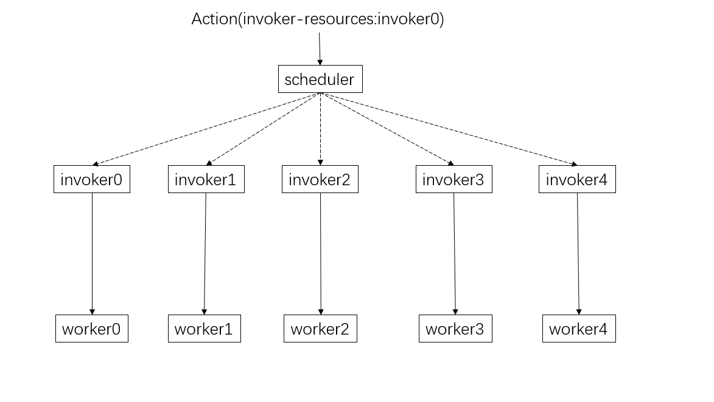

# 前言

鉴于Apache OpenWhisk 在 Kubernetes 上的部署功能无法满足笔者的需求，我的团队需要扩展 [openwhisk-deploy-kube](https://github.com/apache/openwhisk-deploy-kube)，以便能够让 OpenWhisk 的动作在指定的工作节点上运行。这样的扩展需要对 OpenWhisk 的源代码进行修改，以适应我们的定制需求。便诞生了这样一个仓库。

# 流程

实际上，修改后的 OpenWhisk 仍然保持与原始架构相似。Apache OpenWhisk 的系统架构可在此处查看：[链接](https://github.com/apache/openwhisk/blob/master/docs/reference.md)

我基于 Apache OpenWhisk 的[教程文档](https://github.com/apache/openwhisk/blob/master/docs/tag-based-scheduling.md)获取了灵感。

以下我来画一个运行的整体流程



其中，每个执行器（invoker）都有对应的工作节点（worker），因此每个执行器只会在特定的工作节点中激活动作。例如，如果动作标记为invoker0，则该动作只会由invoker0在worker0上激活，从而满足了我们的需求。

# 使用

在按照官方文档的指引完成了在Kubernetes上部署OpenWhisk后，您可以运行以下命令：

```
bash label_nodes.sh
```

然后等待`install-packages`状态为完成，并按照[这个指南](https://github.com/apache/openwhisk-deploy-kube?tab=readme-ov-file#configure-the-wsk-cli)进行配置。

接着，您可以随机创建动作，并指定执行器（invoker），例如：

```
wsk -i action create hello.js hello -a invoker-resources '["invoker0"]'
```

这样就完成了部署和配置。

# 后记

经过测试，发现invokeri与workeri并不是一一对应的。例如invoker1可能在worker3中激活。